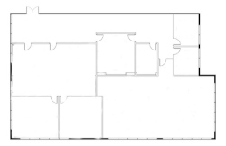

<!-- DO WE NEED A LOGO?  WHY NOT! -->
<div align="center">
  

  <h2 align="center">Office Floorplan Generator (Java Edition)</h2>
  <p align="center">
A floorplan generator for COMP-10019!
  </p>
</div>

## Stuff You Will Need to Know
* How to define the building envelopes
* How to control the generation details via the ``config.yml`` file
* How to run the tool to generate the floorplan and company data

## Defining the Building Envelopes
Located within the ``resources`` folder, the `envelopes` folder contains a 
subfolder for each defined building envelope.  Inside each subfolder are two
templates, named ``inner.txt`` and ``outer.txt``, that define the envelope and
basic layout elements of the building, including key spaces such as stairs/
elevators, washrooms, etc.

These files must have identital shape definitions, but can have different
internal structures defined.  They should have the same contents, but you can
vary the layout of corridors so that the building floors can show some variety.

The structure of the ``inner.txt`` and ``outer.txt`` files is as follows:
* Line 1: Width of building
* Line 2: Height of building
* All following lines: Details of the building layout (design), using a simple
numeric code to describe the usage of each building **tile** (a 1 square foot
section of the building):
    * 0 - Undefined (open for use as office space or other room types)
    * 1 - Unusable space (this is how irregular buildings shapes are defined)
    * 2 - Access points (stair and elevator space)
    * 3 - Corridors/walkways
    * 4 - Closets/utility rooms
    * 5 - Washrooms

Example ``inner.txt`` (for a very small building):
```
30
16
000003334444400000000000000000
000003334444400000000000000000
000003334444400000000000000000
000003334444400000000000000000
000003330000000000000000000000
000003330000000000003333111111
000003330000000000003333111111
000003333333333333333333111111
000003333333333333333333111111
000003333333333333333333111111
222223330000000000003333111111
222223330000000000003333111111
222223330000000000000000000000
222223330000000000000000000000
222223330000000000000000000000
```

## How to Generate Floorplans
Also inside the ``resources`` folder is the file ``config.yml``, which defines
key details of the floor definitions.  

The following parameters can be defined and configured:
* peoplePerOffice: - takes an integer value which defines how many people sit in a given 8x10 cubicle area (hint: use 1)
* overflowMin: - No idea 
* meetingRoomsPerFloor: - defines how many conference/meeting rooms will be added to a each floor (note that this is a maximum number, so it is possible that any number from 0 to the maximum defined here will be added) (hint: use 2)
* executiveOfficesClustered: - this boolean value changes the behaviour of the room allocation; when True it will cluster executive offices on one floor, but when False will place executives adjacent their respective departments
* are there more?
* I don't know

Example ``config.yml`` file:
```
# Allowed types of data: integer, string, boolean
peoplePerOffice: 1
overflowMin: 5

meetingRoomsPerFloor: 2 # recommended: 2

executiveOfficesClustered: False
```

## How to Generate Floorplans
In the directory containing the `OfficeGenerator-**versionnumber**.jar` file, 
run the generator as follows:
```
java -jar OfficeGenerator-**versionnumber**.jar **numbertogenerate**
```
Example:
```
java -jar OfficeGenerator-1.0.jar 10
```
This will create output in the `companies` directory.  Each generated company
will be in its own directory that will contain an **svg** file for each floor
and a file called ``company.txt`` that contains the details requried for the
case study: the company name and description, as well as the names and sizes of
each department.
